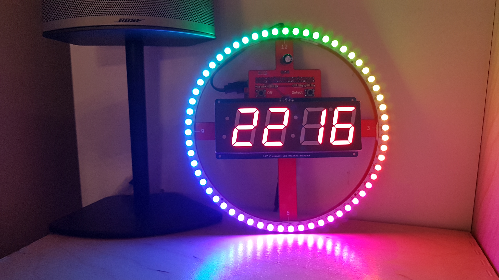
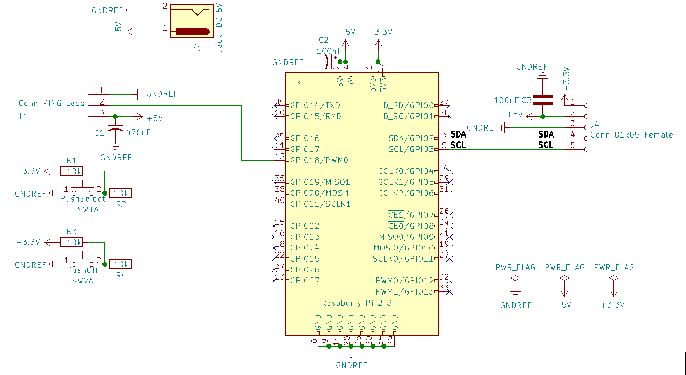
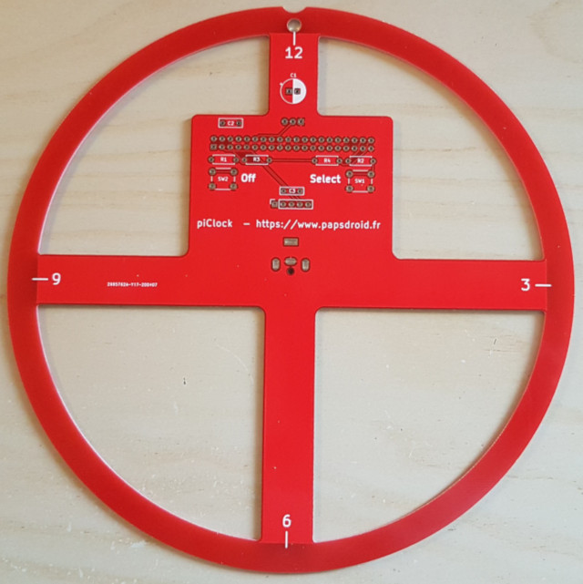
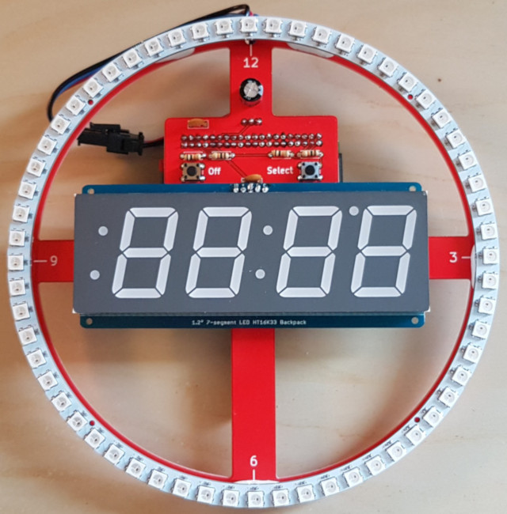
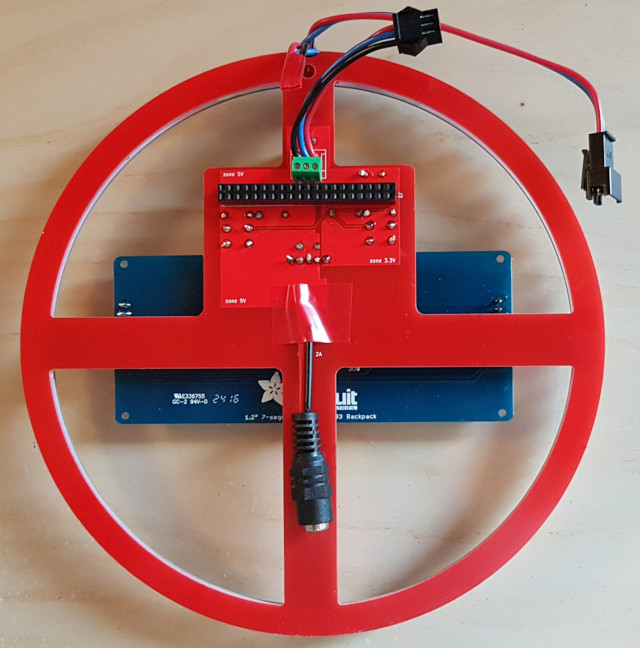
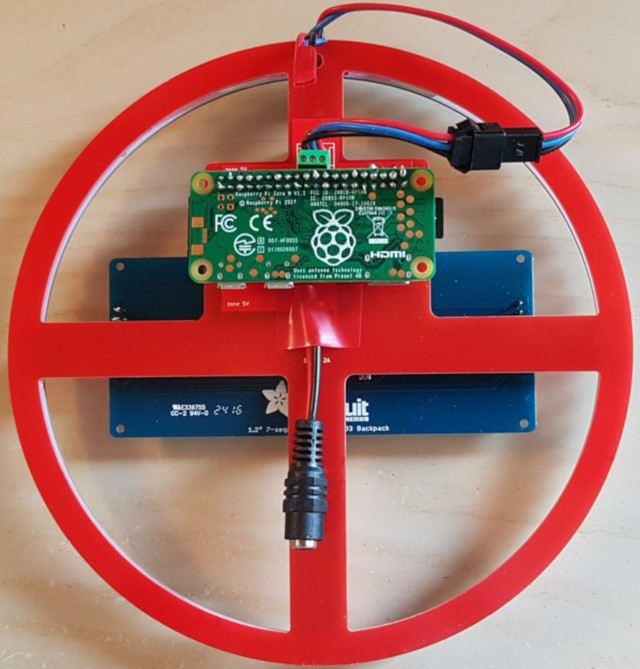

# piClock
source projet piClock sur https://www.papsdroid.fr

Horloge lumineuse à l'aide d'un raspberry pi zéro aux commandes d'un anneau de 60 leds RGB et d'un afficheur 7 segments adafruit de grande taille (1,2"). Un bouton "off" permet d’éteindre correctement tout le système, et un autre bouton poussoir "select" permet quand à lui de modifier le style de l'horloge, avec une option d'extinction de l'anneau de leds (extinction automatique de l'anneau à minuit)




## materiel nécessaire

* Un raspberry pi zéro **WH** (wifi et connecteur GPIO): 15 €
* microSD card 16Go sandisk A1  (8Go suffisent): 7€
* Bloc d'alimentation 5V 3A jack: 10€
* Anneau 60 leds RGB 172mm: 30€. Le PCB a été ralisé sur mesure pour [ce modèle](https://www.amazon.fr/gp/product/B07PXDJV48/ref=ppx_yo_dt_b_asin_title_o09_s00?ie=UTF8&psc=1)
* 7 segment-display adafruit 1,2" avec backpack: 25€.  bien prendre [ce modèle 1.2"](https://www.amazon.fr/Adafruit-4-Digit-7-Segment-Display-Backpack/dp/B00XW2NSU2/ref=sr_1_2?__mk_fr_FR=%C3%85M%C3%85%C5%BD%C3%95%C3%91&dchild=1&keywords=Adafruit+1.2%22+4-Digit+7-Segment+Display+w%2FI2C+Backpack&qid=1587801674&s=computers&sr=1-2)
* Carte PCB: comptez 30€ en 5 exemplaires (télécharger les fichiers GERBER sur le github)

divers composants électronique: 5€

* 4 résistances (1/4W) 10kΩ
* 2 boutons poussoir 6mm type NO
* 2 condensateurs céramiques 100nF
* 1 condensateur chimique polarisé 470uF
* 1 barrette 2*20 pin femelle à souder, 2.54mm (pour raspberry pi)
* 1 connecteur jack DC 3 pin à souder
* 1 bornier 3 pins 2.54mm à souder (pour brancher l'anneau)

## Schéma électronique
Ce circuit est facilement réalisable sur une breadboard



## configuration du système

Pour configurer son raspberry piZero: suivez [ce guide](https://www.papsdroid.fr/post/configurer-pizero)

Installer ensuite les dépendances [Neopixel d'Adafruit](https://learn.adafruit.com/adafruit-neopixel-uberguide/python-circuitpython)

```bach
sudo apt install python3-pip
sudo pip3 install adafruit-circuitpython-neopixel
```

Enfin installer les dépendance [python HT16K33 d'Adafruit](https://learn.adafruit.com/adafruit-led-backpack/python-wiring-and-setup-d74df15e-c55c-487a-acce-a905497ef9db)
qui va permettre de commander l'afficheur 7 segments via son backpack

```bach
pip3 install adafruit-circuitpython-ht16k33
sudo apt-get install python3-pil
```

il reste à récupérer le code Python qui gère toute l'horloge, directement sur mon github,avec ces commandes:

```bach
git clone https://github.com/papsdroidfr/piClock
ls -l
```

Vous devriez voir un répertoire nommé piClock sur /home/pi avec à l’intérieur les fichiers GERBER files zipés (ne servent à rien à ce stade) 
et le programme python **piClock.py**


Dernière étape pour que le programme puisse s’exécuter automatiquement au démarrage du Raspberry pi, ajouter ceci dans le fichier /etc/rc.local:

```bach
sudo nano /etc/rc.local
    # à la fin du fichier, juste avant exit 0 ajouter ceci:
sudo python3 -u '/home/pi/piClock/piClock.py' > '/var/log/piClock.log' 2>&1 &
    # CTRL O pour sauvegarder, puis CTRL-X pour quitter
```

En éteignant le Raspberry pi (sudo poweroff), le programme piClock.py sera automatiquement exécuté à chaque démarrage.


## préparation du circuit



* Commencer par placer sur le dessus: les 4 résistances, les 2 petits boutons poussoirs et les 2 condensateurs céramiques repérés par c2 et c3 sur le circuit imprimé. Les soudure doivent être réalisée au dessous.
* Souder ensuite le condensateur polarisé c1 (à positionner au dessus comme le reste): attention au sens la patte la plus longue doit être là où est le +
* passons de l'autre côté: au dessous du circuit imprimé pour y placer la barrette femelle 2*20 pin (soudures apparentes au dessus donc), ainsi que le petit bornier 3 points sur lequel on va brancher l'anneau de Leds.
* Reliez au dessous une prise jack DC femelle avec des câbles soudés directement sur les +5V (fil rouge) et GND (fil noir). Les soudures sont donc apparentes au dessus.Pour protéger les courts-circuits il faut mettre un bout de chatterton (rouge) sur les soudures qui risquent de rentrer en contact avec l'électronique du backpack de l'afficheur 7 segment.
* souder ensuite l'afficheur 7 segment directement sur son backpack avec les 5 pin header mâles comme expliqué sur le site d'Adafruit. Attention à ne pas vous tromper de sens ...
* Enfin vous pouvez alors positionner l'afficheur et son backpack et souder les 5 pins dans les 5 trous centraux, juste en dessous du condensateur céramique c3 (attention d'avoir bien soudé d'abord le connecteur jack femelle avant !)




* Pour brancher l'anneau j'ai sectionné le cable jst-sm femelle 3 points qui permet de brancher plusieurs anneaux en cascades et l'ai relié au bornier 3 points, afin de pouvoir y brancher l'autre connecteur jst-sm mâle dessus. Vous pouvez aussi tout sectionner pour brancher directement les fils dans le bornier ... Pour protéger les soudures apparentes sur l'anneau j'utilise un petit bout de chatterton rouge.
* Positionnez l'anneau fil vers le haut: la leds 0 doit se trouver au milieu du 12, idem pour les leds 15, 30 et 45 qui doivent être en face du 3, 6 et 9 du circuit imprimé. Pour maintenir l'anneau en place j'utilise des petits morceaux de boule gomme, ce qui permet de gérer l'occupation prises par les fils qui partent de l'anneau.
* Loger ensuite le raspberry pi ZERO sur son connecteur, par dessous donc



Vous pouvez maintenant brancher l'alimentation 5V sur le jack: 
la petite led verte du Raspberry pi zero va clignoter le temps qu'il démarre, et ensuite l'horloge démarre toute seule. 
Il faut laisser le temps au Raspberry pi de se connecter au wifi et l'heure va se mettre à jour toute seule 
C'est normal qu'au premier démarrage l'heure affichée n'est pas immédiatement correcte: dès que le wifi est capté, l'heure va se mettre à jour toute seule.

Plus de détail et vidéo démonstrative sur [papsdroid.fr](https://www.papsdroid.fr/post/piclock)


